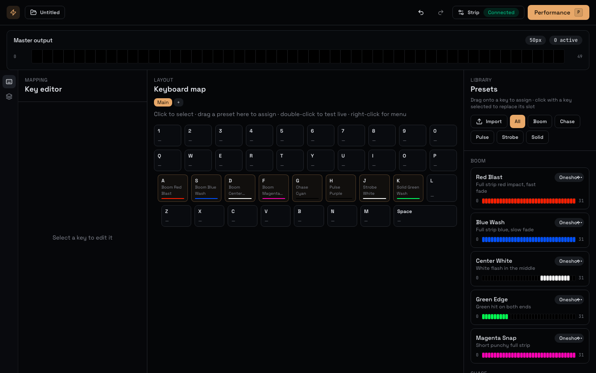

# midi-vj

Browser-based LED strip VJ controller. Map keyboard keys to lighting effects, layer them, and perform live over WebSocket to a Govee/Razer Chroma UDP backend.



## Features

- **Keyboard map** — assign presets to keys with drag-and-drop from the library
- **Effect slots** — multiple effects per key with blend modes (`over`, `add`, `max`, `replace`)
- **Key layers** — cross-key z-order so some keys always draw on top
- **Groups** — switch between mapping sets for different parts of a show
- **Performance mode** — full keyboard layout with live strip preview and key feedback
- **Presets** — boom, chase, pulse, strobe, solid with customizable parameters
- **Project persistence** — saves to localStorage with undo/redo

## Stack

| Package | Role |
|---------|------|
| `packages/core` | Effect engine, mixer, presets, project model |
| `apps/server` | WebSocket API, render loop, UDP output to strip |
| `apps/web` | React UI (Vite + Tailwind) |

## Quick start

Requires [pnpm](https://pnpm.io) and Node 20+.

```bash
pnpm install
pnpm dev
```

Open [http://localhost:5173](http://localhost:5173). The dev server proxies WebSocket traffic to the backend on port **8787**.

### Strip output

By default the server sends UDP packets to `10.0.0.90:4003` (Govee/Razer Chroma protocol). Change the target IP in **Strip settings** in the UI, or set `DRY_RUN=1` to disable UDP:

```bash
DRY_RUN=1 pnpm --filter @midi-vj/server dev
```

## Development

```bash
pnpm build      # build all packages
pnpm typecheck  # typecheck all packages
```

Press **P** to enter performance mode, **Esc** to exit.

## License

MIT
